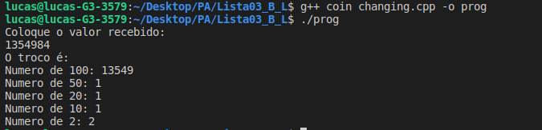

## README

Trabalho 03 - Grafos

Disciplina **Projeto de Algoritimo**

Professor **Mauricio Serrano**

Alunos:

|Nome|Matricula|git|
|--|--|--|
|Brian Lui |15/0006802|[@brian2397](https://github.com/Brian2397)|
|Lucas Machado |15/0015917|[@lmmLucasMachado](https://github.com/lmmLucasMachado)|

## Interval Partitioning

### Executar programa 1

- Compile o programa : g++ interval_partitioning.cpp  -o prog -std=c++11
- Execute o programa com: ./ prog
- Entre com o numero de aulas que deseja inserir.
- Coloque o horario de inicio e fim das aulas e pressione enter a cada inserção.
- No seu terminal aparecerá a mensagem com o numero de aulas e o total de salas usadas que serão necessárias.

**Obs:** caso deseje utilizar os inputs prontos, siga os passos abaixo:

- Compile o programa: g++ trabalho_03.cpp  -o prog -std=c++11
- Execute o programa com: **./prog < input_1**
- No seu terminal aparecerá a mensagem com o numero de aulas e o total de salas usadas que serão necessárias.

### Prints aplicação

## Coin Chnging

### Executar programa 2

- Compile o programa : g++ coin_changing.cpp  -o prog2 -std=c++11
- Execute o programa com: ./ prog2
- Entre com o valor do dinheiro recebido.
- No seu terminal aparecerá o valor minimo de notas possiveis.

### Prints aplicação

